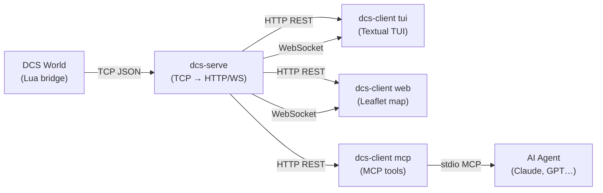

# dcs-bridge

**dcs-bridge** is a generic bridge between DCS World and external consumers (TUI, web UI, AI agents).

## Overview



## Features

- **Lua bridge** — injected into DCS World, streams unit positions and events in real time
- **dcs-serve** — TCP/HTTP/WebSocket server, in-memory snapshot, API key authentication
- **dcs-client tui** — Textual terminal UI with real-time unit table and Lua REPL
- **dcs-client web** — Leaflet map with coalition-coloured markers, real-time updates
- **dcs-client mcp** — MCP server exposing `exec_lua`, `get_units`, `spawn_unit`, `get_mission_info`

## Quick Start

```bash
# 1. Start the server
dcs-serve

# 2. Open the web UI (in another terminal)
dcs-client web

# 3. Or launch the TUI
dcs-client tui
```

See the [Installation guide](guide/installation.md) for full instructions.
