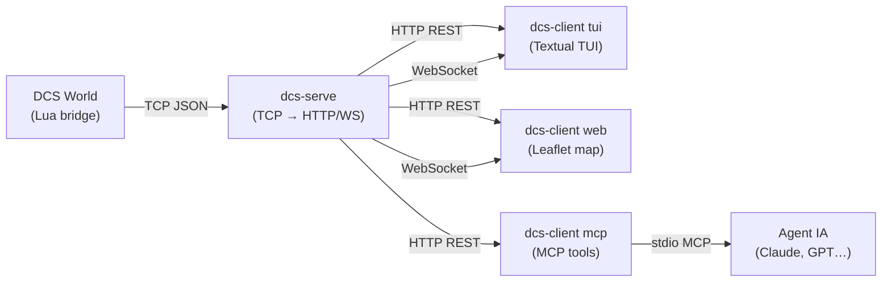

# dcs-bridge

**dcs-bridge** est un pont générique entre DCS World et des consommateurs externes (TUI, interface web, agents IA).

## Vue d'ensemble



## Fonctionnalités

- **Bridge Lua** — injecté dans DCS World, envoie les positions des unités et les événements en temps réel
- **dcs-serve** — serveur TCP/HTTP/WebSocket, snapshot en mémoire, actions capability-aware, authentification par rôle (token Bearer)
- **dcs-client tui** — interface terminal Textual avec tableau des unités en temps réel et REPL Lua
- **dcs-client web** — carte Leaflet avec marqueurs colorés par coalition, mise à jour en temps réel
- **dcs-client mcp** — serveur MCP exposant `exec_lua`, `get_units`, `spawn_unit`, `get_mission_info`

## Démarrage rapide

```bash
# 1. Lancer le serveur
dcs-serve

# 2. Ouvrir l'interface web (dans un autre terminal)
dcs-client web

# 3. Ou lancer le TUI
dcs-client tui
```

Consultez le [Guide d'installation](guide/installation.md) pour les instructions complètes.
