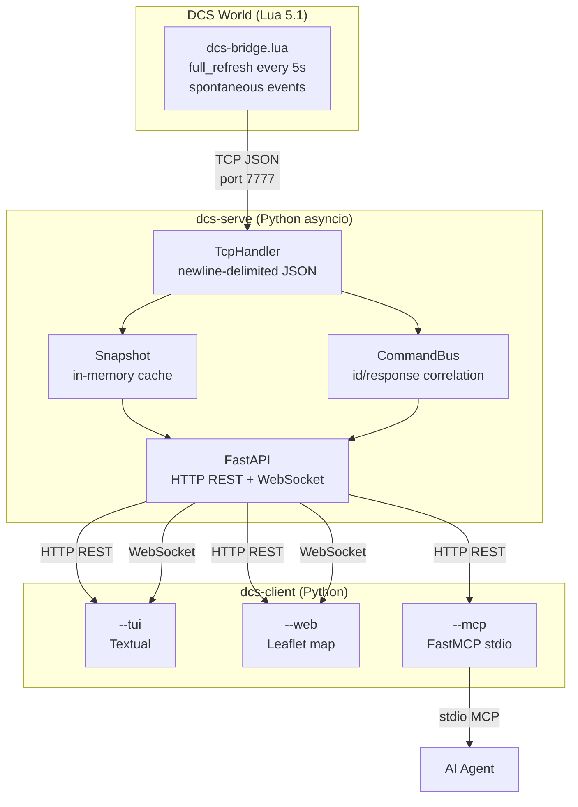

# Architecture

## Overview

dcs-bridge is composed of three independent layers:



## Components

### dcs-bridge.lua

Lua 5.1 script running in the DCS simulation thread. It is called on every frame (~20 Hz) by the DCS scheduler.

- Outgoing TCP connection to `dcs-serve` (non-blocking, `settimeout(0.0001)`)
- Exponential reconnect (1s → 30s)
- Sends a `full_refresh` every 5 seconds
- Spontaneous events: `unit_position`, `unit_spawned`, `unit_destroyed`
- Executes received commands: `exec` (arbitrary Lua) and `spawn`

### dcs-serve

Python asyncio server with two services co-located in the same event loop:

| Component | Role |
|---|---|
| `TcpHandler` | Accepts DCS connection, parses newline-delimited JSON |
| `Snapshot` | In-memory cache of active units, staleness detection |
| `CommandBus` | Command/response correlation by `id` with timeout |
| `EventBroadcaster` | Thread-safe fan-out of events to WebSocket clients |
| `FastAPI app` | REST routes + WebSocket, X-API-Key middleware |

### dcs-client

Three independent modes sharing the same `ClientConfig`:

| Mode | Description |
|---|---|
| `tui` | Textual UI, unit table, Lua REPL |
| `web` | FastAPI StaticFiles server + Leaflet JS map |
| `mcp` | FastMCP stdio server, tools for AI agents |

## Data flows

### Upward path (DCS → clients)

```
DCS World → [TCP JSON] → TcpHandler → Snapshot / EventBroadcaster
                                            ↓
                              GET /api/units  WS /ws/stream
                                            ↓
                              dcs-client tui / web / mcp
```

### Downward path (client → DCS)

```
dcs-client mcp/tui
    ↓ POST /api/exec or /api/spawn
FastAPI → CommandBus.register(id)
    ↓ Command JSON via TCP
dcs-bridge.lua → Lua execution → Response JSON via TCP
    ↓
CommandBus.wait(id, timeout) → result to client
```

## Key architecture decisions

- [ADR-0001](../adr/0001-lua-coord-conversion.md) — Coordinate conversion on the Lua side
- [ADR-0002](../adr/0002-push-based-snapshot.md) — Push-based snapshot
- [ADR-0003](../adr/0003-reconnexion-lua-backoff.md) — Reconnect with exponential backoff

## Repository structure

```
dcs-bridge/
├── src/
│   ├── dcs_bridge/
│   │   ├── common/          # Shared Pydantic models, protocol enums
│   │   ├── serve/           # dcs-serve: TCP handler, snapshot, FastAPI
│   │   └── client/
│   │       ├── tui/         # Textual UI
│   │       ├── web/         # HTTP server + static/ (HTML/JS Leaflet)
│   │       └── mcp/         # FastMCP server
│   └── lua/
│       └── dcs-bridge.lua   # Lua bridge script
├── test/                    # pytest tests
├── docs/                    # MkDocs documentation
│   ├── guide/               # User documentation
│   ├── technical/           # Technical documentation
│   └── adr/                 # Architecture Decision Records
├── mkdocs.yml
├── pyproject.toml
├── dcs-serve.spec           # PyInstaller spec
└── dcs-client.spec          # PyInstaller spec
```
