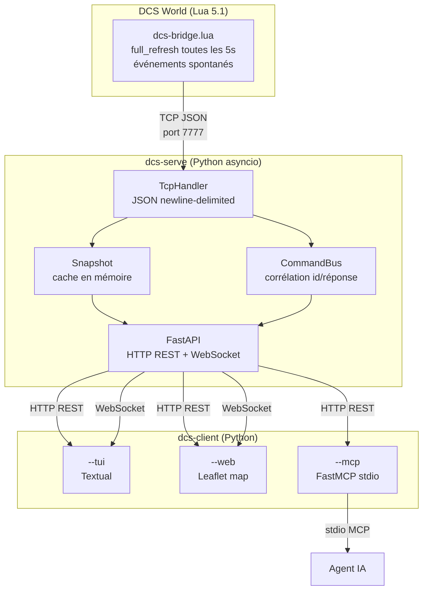

# Architecture

## Vue d'ensemble

dcs-bridge est composé de trois couches indépendantes :



## Composants

### dcs-bridge.lua

Script Lua 5.1 exécuté dans le thread de simulation DCS. Il est appelé à chaque frame (~20 Hz) par le planificateur DCS.

- Connexion TCP sortante vers `dcs-serve` (non-bloquante, `settimeout(0.0001)`)
- Reconnexion exponentielle (1s → 30s)
- Envoi d'un `full_refresh` toutes les 5 secondes
- Événements spontanés : `unit_position`, `unit_spawned`, `unit_destroyed`
- Exécution des commandes reçues : `exec` (Lua arbitraire) et `spawn`

### dcs-serve

Serveur asyncio Python avec deux services co-localisés dans la même boucle d'événements :

| Composant | Rôle |
|---|---|
| `TcpHandler` | Accepte la connexion DCS, parse le JSON newline-delimited |
| `Snapshot` | Cache en mémoire des unités actives, détection de péremption |
| `CommandBus` | Corrélation commande/réponse par `id` avec timeout |
| `EventBroadcaster` | Fan-out thread-safe des événements vers les WebSocket clients |
| `FastAPI app` | Routes REST + WebSocket, middleware X-API-Key |

### dcs-client

Trois modes indépendants partageant la même `ClientConfig` :

| Mode | Description |
|---|---|
| `tui` | Interface Textual, tableau des unités, REPL Lua |
| `web` | Serveur FastAPI StaticFiles + carte Leaflet JS |
| `mcp` | Serveur FastMCP stdio, outils pour agents IA |

## Flux de données

### Chemin montant (DCS → clients)

```
DCS World → [TCP JSON] → TcpHandler → Snapshot / EventBroadcaster
                                            ↓
                              GET /api/units  WS /ws/stream
                                            ↓
                              dcs-client tui / web / mcp
```

### Chemin descendant (client → DCS)

```
dcs-client mcp/tui
    ↓ POST /api/exec ou /api/spawn
FastAPI → CommandBus.register(id)
    ↓ Command JSON via TCP
dcs-bridge.lua → exécution Lua → Response JSON via TCP
    ↓
CommandBus.wait(id, timeout) → résultat au client
```

## Décisions d'architecture clés

- [ADR-0001](../adr/0001-lua-coord-conversion.md) — Conversion de coordonnées côté Lua
- [ADR-0002](../adr/0002-push-based-snapshot.md) — Snapshot push-based
- [ADR-0003](../adr/0003-reconnexion-lua-backoff.md) — Reconnexion avec backoff exponentiel

## Structure du dépôt

```
dcs-bridge/
├── src/
│   ├── dcs_bridge/
│   │   ├── common/          # Modèles Pydantic partagés, enums de protocole
│   │   ├── serve/           # dcs-serve : TCP handler, snapshot, API FastAPI
│   │   └── client/
│   │       ├── tui/         # Interface Textual
│   │       ├── web/         # Serveur HTTP + static/ (HTML/JS Leaflet)
│   │       └── mcp/         # Serveur FastMCP
│   └── lua/
│       └── dcs-bridge.lua   # Script Lua bridge
├── test/                    # Tests pytest
├── docs/                    # Documentation MkDocs
│   ├── guide/               # Documentation utilisateur
│   ├── technical/           # Documentation technique
│   └── adr/                 # Architecture Decision Records
├── mkdocs.yml
├── pyproject.toml
├── dcs-serve.spec           # PyInstaller spec
└── dcs-client.spec          # PyInstaller spec
```
